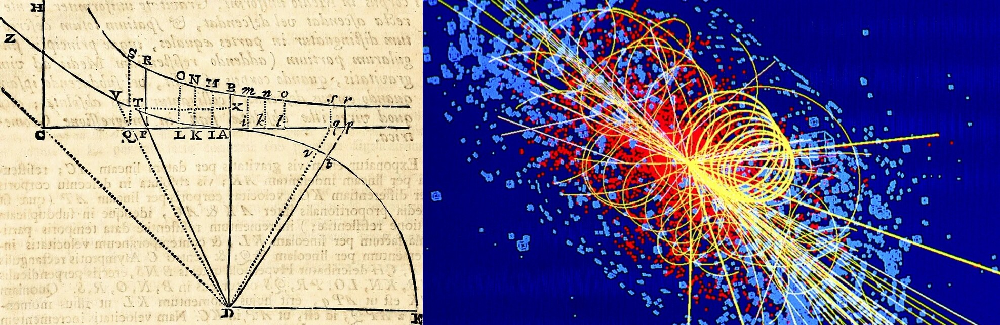

I write about the experiments that built modern physics: the apparatus, the data, and the arguments behind the theories. I pay attention to the wrong turns, not just the results.

##  Core Branches

**Quantum Mechanics** — Blackbody radiation, the Stern–Gerlach experiment, and the double-slit experiment.

**Classical Electrodynamics** — Faraday's induction experiments and Maxwell's equations.

**Relativity & Modern Physics=** — The Michelson–Morley experiment and the measurement of the speed of light.

## 🧭 Navigation

> [!info] Tip
> Use the **Graph View** in the right sidebar to see how experiments, constants, and people connect across the archive.
